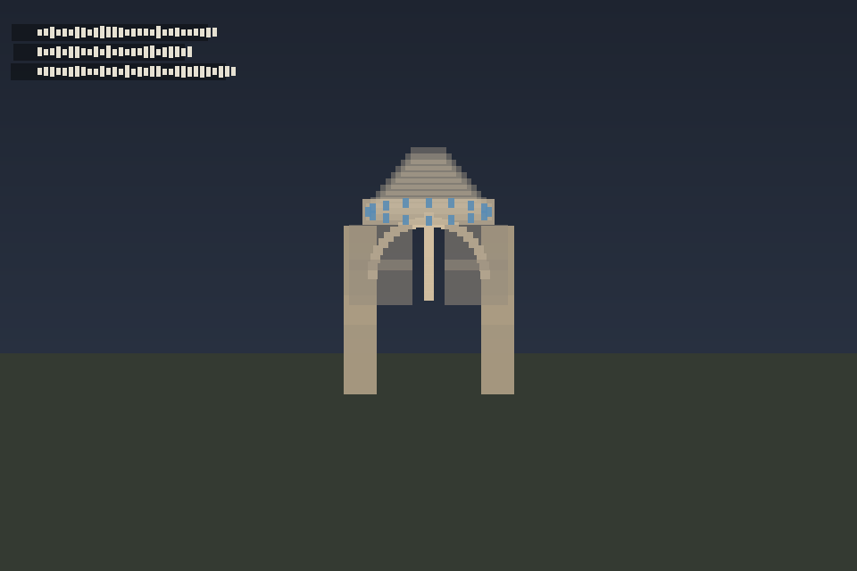

# H16 — Temple forms + universal geometry kit

## H16.0 — Temple forms

Branch `eco/h16-temple-forms` → merge `b611ed8a`. ActArtech MIT plugin as
`packages/plugin-hagia-sophia` (dome, arch, pendentive, pier, column + Temple forms panel).

| Check | Result |
|---|---|
| `bun test` in plugin-hagia-sophia | **74 pass** |
| production | READY at https://architect-editor-snowy.vercel.app (`b611ed8a`) |

Screenshot: 

Do **not** rename `hagia-sophia:*` kind ids. Credit ActArtech in panel / README / LICENSE.

## H16.1 — Universal geometry kit

Branch `eco/h16-1-geometry` → merge `46ca57b9` (feature `be4929ce`).

Package `packages/plugin-geometry`: 20 plain-named construction forms, Geometry rail panel,
place / bearing / lock, plan-snap, walls-from-figure, user forms, 3D construction lines,
**floorplan 2D overlay**, **drag scale handle** (2D + 3D), fuller **13 Archimedean** vertex sets.

| Check | Result |
|---|---|
| `bun packages/plugin-geometry/test/check-h16-geometry.mjs` | **OK** (20 forms, 13 Archimedean, 11 tilings) |
| `bun install --frozen-lockfile` + `bun run build --filter=editor` | green (local bun; npx bun@1.3.14 TLS-blocked on agent) |
| preview (`be4929ce`) | READY branch alias `architect-editor-git-eco-h16-1-geometry-…` |
| production | READY https://architect-editor-snowy.vercel.app (`46ca57b9`) |

### Deferred

- **Soap-film / minimal surface on a closed curve** — reuses H15.3’s generator (placeholder guide in kit until then).

### Banned UI labels

No “sacred”, “divine”, Flower of Life, Metatron, Seed of Life, vesica piscis, or Platonic as labels
(keywords only). Enforced by `check-h16-geometry`.

## H16.2 — Hanging-chain arches and vaults

Branch `eco/h16-2-catenary`.

Catenary arch profile (`y = a·cosh(x/a)` fitted to span + rise), vault = extruded profile,
dome of revolution with catenary meridian. Poleni’s line of thrust drawn in the ring; panel
warns when it leaves the middle third. ActArtech `hagia-sophia:*` kinds unchanged.

| Check | Result |
|---|---|
| `bun test` in plugin-hagia-sophia | **81 pass** |
| `bun test/check-h16-2.mjs` | **OK** (springings + crown ≤ 1 mm; Poleni middle third) |
| `bun install --frozen-lockfile` + `bun run build --filter=editor` | green (local bun; npx bun@1.3.14 TLS-blocked on agent) |
| preview (`aa5a96d2`) | READY https://architect-editor-git-eco-h16-2-catenary-pauls-projects-af8162cc.vercel.app |
| production | READY https://architect-editor-snowy.vercel.app (`aa5a96d2`) |

## H16.3 — Curved solids (body kernel)

Branch `eco/h16-3-body` → merge `17a45121`.

Package `packages/plugin-body`: qurkuid half-edge kernel (arcs, sweep, CSG, push-pull,
offset) + `body` / `body-group` kinds registered via plugin (core schema untouched).
English README translates upstream design notes. Deferred: body-containers/array,
full modeling UI / SketchUp import glue.

| Check | Result |
|---|---|
| `bun test` in plugin-body | **88 pass** |
| `bun test/check-h16-3.mjs` | **OK** (push-pull, arc, sweep, CSG) |
| `bun install --frozen-lockfile` + `bun run build --filter=editor` | green (local bun; npx bun@1.3.14 TLS-blocked on agent) |
| preview (`17a45121`) | READY branch alias `architect-editor-git-eco-h16-3-body-…` |
| production | READY https://architect-editor-snowy.vercel.app (`17a45121`) |

## Later

H16.5 IFC + envelope — see the H16 brief; queued notes in `H17-H18-queued.md`.

## H16.4 — Walk the design in VR

Branch `eco/h16-4-xr`.

Port of pascalorg WebXR (`packages/viewer/src/xr/**`, `@webxr/plugin`) behind
`NEXT_PUBLIC_WEBXR` + scene plugin install. Human mode resets scene scale to 1:1;
scene BVH / human collider re-scan so eco terrain is walkable.

| Check | Result |
|---|---|
| `bun packages/viewer/test/check-h16-4.mjs` | **OK** |
| `bun test packages/viewer/src/xr` (+ viewer-camera) | **49 pass** |
| `bun install --frozen-lockfile` + `bun run build --filter=editor` | green (local bun; npx bun@1.3.14 TLS-blocked on agent) |
| preview (`cfdf7662`) | READY https://architect-editor-git-eco-h16-4-xr-pauls-projects-af8162cc.vercel.app |
| production | READY https://architect-editor-snowy.vercel.app (`31ff0a89`) |
