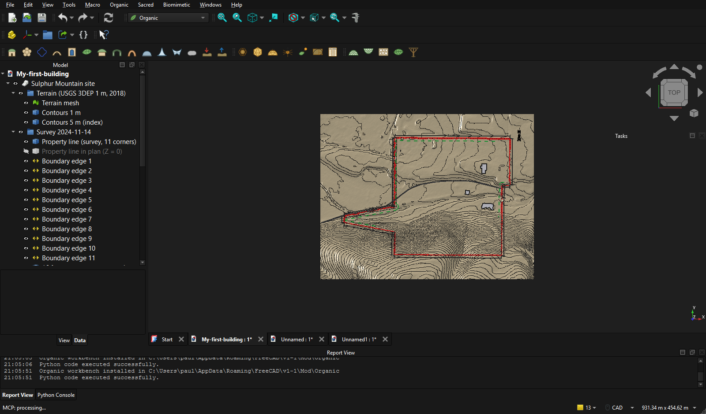
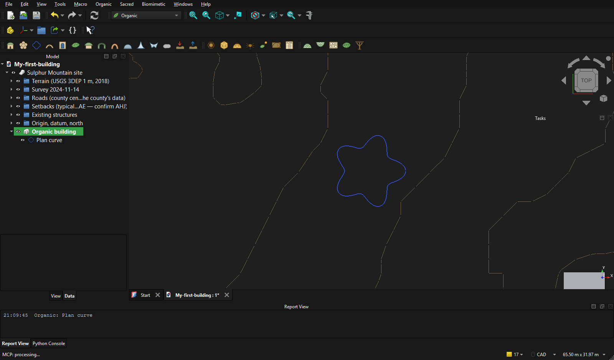
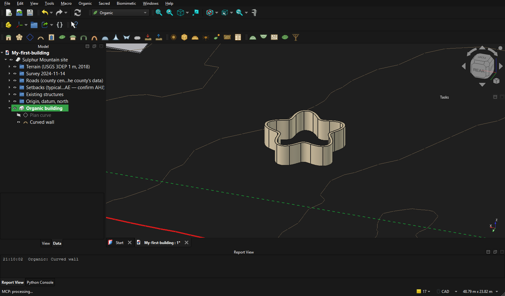
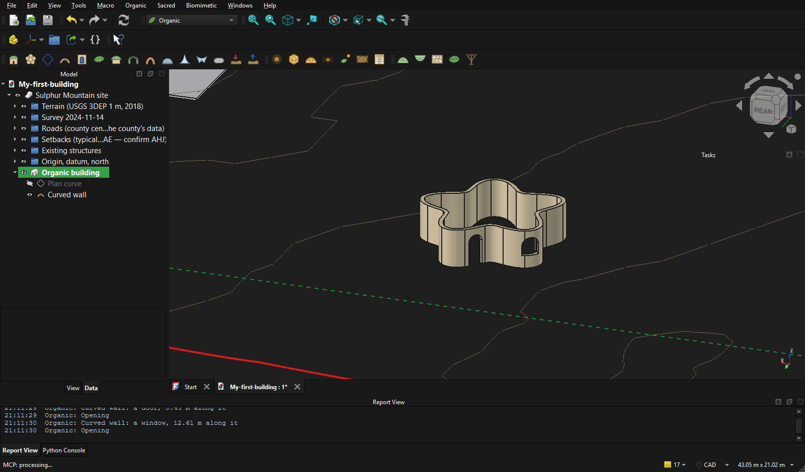
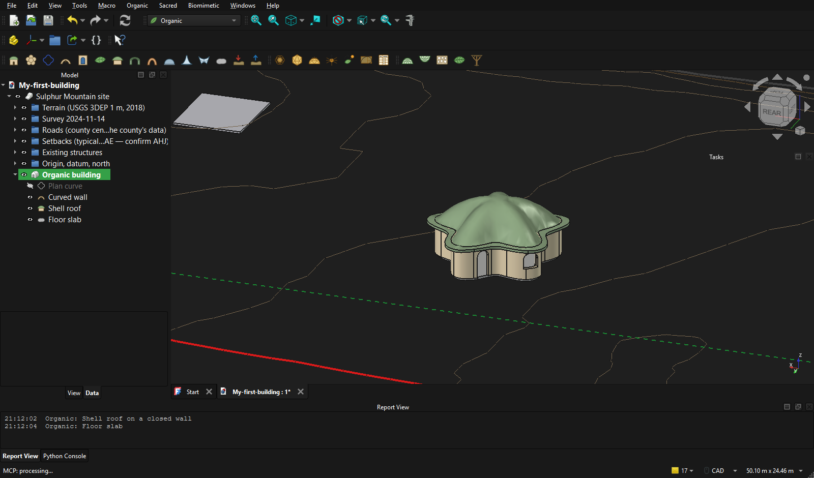
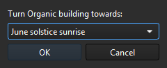
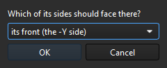
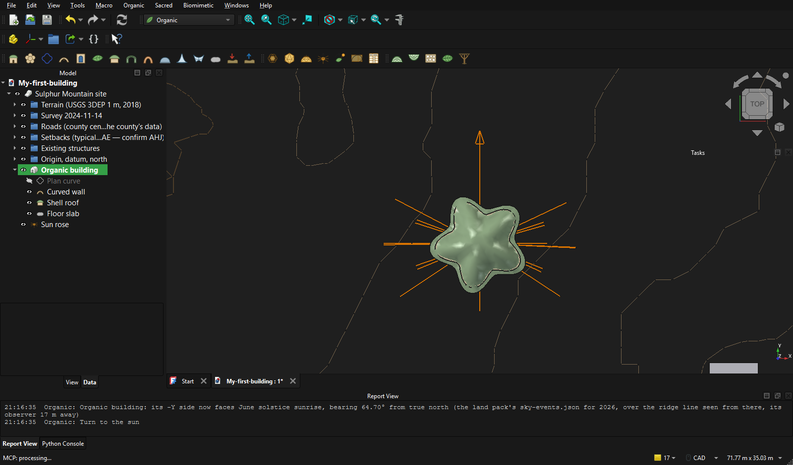
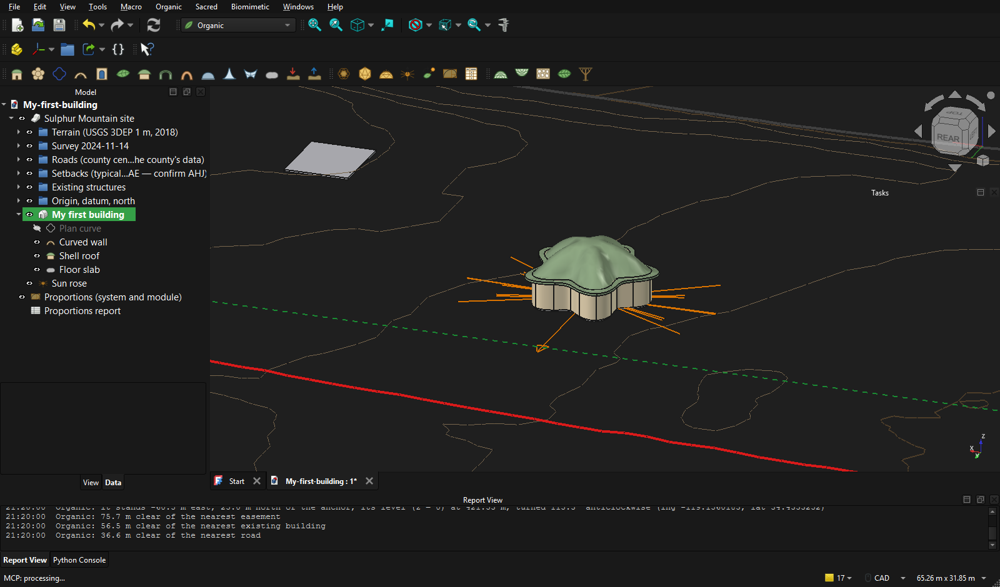
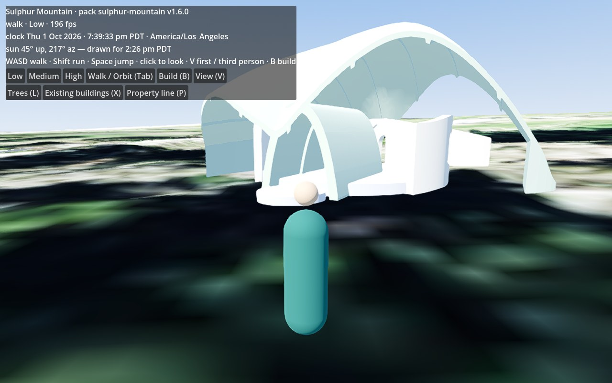

# From an empty FreeCAD to your building in the map

For Johny. One page, in the order you click. Everything here was done on this PC on 1 Oct
2026 with real clicks; the pictures are from that run. Lengths are metres.

## Before you start

- FreeCAD 1.1 is open. The **Organic** workbench is already installed on this PC.
- At the top of the window there is a box with the name of a workbench. Choose **Organic**
  in it. Three rows of buttons appear: **Organic** (15 buttons), **Sacred** (7) and
  **Biomimetic** (5). Rest the mouse on a button and it says its name.
- The line of text at the bottom, **Report view**, says what each button did.

## 1. Open your land

1. **File ▸ Open…**
2. Go to **Documents ▸ SulphurMountain** and open **SulphurMountain-site.FCStd**.
3. **File ▸ Save As…** and give it your own name (for example `My-house.FCStd`), so the
   land's own file stays clean.

You see the land from above: the ground from the 2018 lidar, a contour every metre, your
property line in red, the easement, the road, the existing buildings. The point (0, 0, 0)
is the house anchor; +Y is true north.

## 2. Say where the building stands

1. Click once on the ground where you want it.
2. Press **New organic building** (the first button, a little house).

Where may it stand? The map shows it: in the map press **B** (build), and the land is
shaded where nothing may be built (the setbacks, the protected oaks, the steep ground,
the easement, the roads); **N** switches the shading. Here in FreeCAD, **Send to the
map** (step 8) tells you what those zones say about your building.

The report view answers, for example: *the building stands where the land was clicked:
-60.50 m east, 24.99 m north of the document's origin, -4.10 m*. In the list on the left
the building is marked green: whatever you make next goes into it and stands there.

To see the lines you draw next, hide the ground's surface (the contours stay): in the list
on the left open **Terrain**, click **Terrain mesh**, press the **Space** key. Space again
brings it back.

## 3. Draw the plan

1. Press **Plan curve** (the third button, a blue outline). A petal-shaped line appears.
2. Click the line. Below the list, on the **Data** tab, are its numbers. **Kind** chooses
   the shape (Lobed, Circle, Arc, S-curve, Oval, Leaf, Shell, Golden spiral, Log spiral,
   Vesica, Points); **Radius**, **Lobes** and **Depth** shape it. Type a number, press
   **Enter**, and the line follows. In the pictures the radius is 5 m.

## 4. Raise the wall

With the line still selected, press **Curved wall** (the fourth button). A wall 0.30 m
thick and 2.70 m high stands on the line. Its own numbers are on the Data tab:
**Thickness**, **Height**, **Top** (Flat, Arch, Wave, Slope) with **TopRise**, and
**Foundation** (how far it runs into the ground).

## 5. Cut the door and the windows

1. Click the wall **near its foot**, where the door goes. Press **Opening** (the fifth
   button). A door 1.0 m wide and 2.2 m high is cut there.
2. Click the wall **higher up**, where a window goes. Press **Opening**. A window 1.2 m
   wide and 1.3 m high, its sill 0.9 m up, is cut there.

The report view says which it made and where: *a door, 8.43 m along it*. Every opening's
width, height, sill and shape (Rect, Arch, Pointed, Round) is in the wall's **Openings**
lists on the Data tab.

## 6. Roof and floor

1. Click the wall. Press **Shell roof on a closed wall** (the seventh button). Wait about a
   quarter of a minute: the roof rises from the wall's top to a crown over the middle.
2. Click the wall again. Press **Floor slab**.

**The short way.** Steps 3 to 6 in one press: **Grow organic building** (the second
button) makes a petal-shaped room with a door, windows to the south, a roof and a floor in
about half a minute. Change its numbers afterwards.

Other things to stand in the building, each one press: **Leaf shell roof**, **Ribbed
vault**, **Catenary arch**, **Dome**, **Minimal surface**, **Saddle shell**; on the
Biomimetic row **Gridshell**, **Hanging net**, **Cellular wall**, **Veined leaf shell**,
**Branching column**.

## 7. The sun and the proportions (the Sacred row)

1. Press **Sun rose**. Orange lines show true north and where the sun rises and sets at
   the solstices, the equinoxes and the days between, over the ridge line as seen from
   that spot.
2. Press **Turn to the sun**. It asks two things, each with a list: which direction, and
   which side of the building should face it. Choose and press **OK** twice. The building
   turns about its own middle; nothing is built again, so it takes a second.

    

3. Press **Proportions report**. A small table opens: each part's sizes in metres and in
   modules, the ratio it has, and the nearest ratio of the chosen system (golden, root 2,
   root 3, musical, Palladio, Fibonacci). **Snap to proportion** sets vaults, domes, leaf
   roofs, saddles and columns onto whole modules and the nearest ratio.

## 8. Send it to the map

1. **Ctrl+S** to save.
2. Click the building in the list on the left.
3. Press **Send to the map** (the arrow pointing up out of a tray).

The report view says where it stands and how far it is from the road, the easement and
the existing buildings. It also says so if it stands **on** one of them, and what the
map's build zones hold there: for example *69 % of it lies where there is to be no
building: protected tree canopy*. No such line means the whole building is on ground
that may be built on. It is told, not stopped: move the building (click it in the list,
change **Placement** on the Data tab) and send it again.

Only what you can see is sent: a part you hid stays at home.

## 9. Look at it in the map

Double-click **`C:\Playground\exchange\godot\build\Sulphur Mountain.exe`**. Your building
stands on the land a second or two after it was sent. Press **Tab** to walk up to it.

In the map, press **B**, click the building and press **O**: FreeCAD opens the design
again. Change it, press **Send to the map** again, and the building in the map is
replaced where it stands.

## The other way round: from the map to FreeCAD

What you draw in the map's build mode can be made exact here. Press **Import from the
map** (the last button of the Organic row, the arrow pointing down into a tray), choose
the building's file in `exchange\godot\built\`, and it is rebuilt from the same parts
these buttons make, at its place on the land. The report view says what it did not
understand, if anything.

## If something is not as written

- **No Organic rows of buttons.** Macro ▸ Macros… ▸ at the bottom, next to "User macros
  location", press **…** and choose `C:\Playground\Architect-editor\freecad` ▸ click
  **InstallOrganic.FCMacro** ▸ **Execute**. It takes a second and needs no restart.
- **A button did nothing.** Read the last line of the report view: it says what the
  button needs (for example *select a closed curve or an Organic wall on one*).
- **Undo** is **Ctrl+Z**, as everywhere.
- **The building is far from the middle of the view.** Click it in the list on the left
  and press **V** then **S** (fit the selection).
